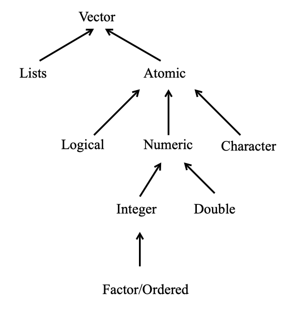

# Atomic Vectors  

At its core, R is an objected-oriented computational and programming environment. Everything in R is an object with different properties.  In this chapter we will go over vectors, these are the core fundamental objects used in R. A vector in R is a 1-dimensional object.  That is, it contains a sequence of elements in a particular order. For example, `v <- c(2, 6, 5)` is a vector with three elements.  The first element is a 2, the second is a 6, and third is a 5.  An object with just a single element, `w <- 3` is just a vector with only one value.  


R can represent different types of data. The types include `double`, `integer`, `complex`, `logical`, `character`, and `raw`. These are the basic fundamental objects we can use in R and are referred to as the `atomic` values. For our class we will not need the `complex` type which stores complex numbers, and in practice `raw` is rarely used. We will concentrate on the remaining four types. Unlike other object-oriented languages we do not need to specify what type of object we are creating when we create it.  Instead, R guesses the type of object you are creating.  To create an atomic vector we use the concatenate function `c()`, where each element of the vector is separated by a comma.  This function will always create an atomic vector. 

- `double`: A vector of real numbers (numbers which may contain decimal values).  We can create these vectors using decimal (12.34) or scientific form (.1234e2). When using numbers this is the default type used. 

- `integer`: A vector of integers (whole numbers).  We can create these vectors using a integer followed by a letter `L`, i.e. `5L`.

- `logical`: A vector containing only `TRUE` or `FALSE` values.  We can create the these vectors using `TRUE` and `FALSE` explicitly, or by doing `T` or `F`. 

- `character`: A vector containing strings.  A string is a sequence of characters made using double quotes or single quotes, i.e. "Hello" and 'Goodbye'. 

An atomic vector only contains elements of the same type.  If the function `c()` is given a mix of elements then it will convert these elements to be all of the same type according to a hierarchy of rules.  The only exception to this is for `NA` values.  The object `NA` is used to indicate missingness, or the lack of a value.  The value `NA` can occur anywhere for all types of vectors. To check the object type we can use the  `typeof()` function.  

Vectors are among the most common types that are used.  All of the different types of vectors we will learn about have special properties and a multitude of features that we can use.  We discuss some of their key properties here, but will continue exploring and learning about their features, and introducing more object types throughout the course.

## Examples 
### Double {-}

Vectors containing double vectors are perhaps the most common. These objects are comparable to doubles in the programming language C. Both the variables `a` and `b` are `double` vectors. When you type a number R will default to creating a double vector. 

```{r}
a <- 17.45
typeof(a)

b <- 5
typeof(b)

c <- c(1, 12.05, 123e-4)
typeof(c)
```


### Integer {-}

We can also create integer vectors which are specifically made to store integer values.  We can do this by following a whole number with the letter `L`. 

```{r}
a <- 5L
typeof(a)

b <-c(1L, 2L, 3L)
typeof(b)
```

Notice that when we define `b<-5` and `b <- 5L` and type `b` into our console it appears the same.  That is, to the user the two definitions look the same.  However, in R integers and doubles are stored in the computer differently and have different features.  For the most part, the difference between integers and doubles is negligable; however, sometimes it can produce strange errors. 


### Logical {-}

Logical values are either `TRUE` or `FALSE` and are created by using logical or relational operators.  In other words, they are created by using statements that compare variables. There are several ways to do logical statements as we saw in Section \@ref(operators). 

```{r}
n <- (10<11)
typeof(n)

m <- c(10<11, 4>5, 3!=1)
typeof(m)
```

We can also assign a value as `TRUE` or `FALSE` manually by setting it equal to `TRUE` or `FALSE`, or by using `T` or `F`. 

```{r}
c <- T
typeof(c)

# Can mix up TRUE/FALSE and T/F
d <-c(T, F, TRUE)
typeof(d)
```


### Character {-}

`Character` values are text. They are often used as data values and labels. 

```{r}

# Double quotes
first <- "George"
typeof(first)

# Single quotes
last <- 'Washington'
typeof(last)

full <- c(first, last)
typeof(full)
```


## Basic Features 

R is a vectorized language, meaning most of the procedures, functions, and operations have been optimized to work with vectors. It is typically advantageous to utilize this feature. 

### Length

We have already learned that we can create vectors using the function `c()`, but this can also be used to make a vector larger. To see how many elements are in a vector we use the `length()` function


```{r}
v1 = c(1, 5, 6)
typeof(v1)
length(v1)


v2 = c(-0.41, -1.20,  pi)
typeof(v2)
length(v2)

v = c(v1, v2)
typeof(v)
length(v)
v
```


### Vectorized Operations and Recylcing

Vectors can be used in arithmetic computations. If the two vectors are of the same length, the computations are performed element-by-element.

```{r}
v1 + v2

v1 * v2
```

Single numbers (scalars) will operate on all the vector elements in an expression. 

```{r}
5*v1

v1/3
```

If you have vectors of different sizes R will *recycle* values in the smaller vector in order to complete the operation.  Sometimes R will give you a *warning* for this, but often it does not. 

```{r}
a <- c(1, 2, 30)
b <- c(10, 20)

a + b 

a < b 
```


### Coercion 

As mentioned above, all elements within a vector must be of the same type.  If you attempt to create a vector where some elements are of a different type than the another then R will convert all the elements to be of one type.  For example, observe what happens when we try to create a vector with logical and double values. 

```{r}
d <- c(TRUE, F, TRUE, 5, 6, 10)
d 
typeof(d)
```

In the above example the values for `TRUE` where converted into `1` and `FALSE` was converted into a `0`. 

R did the above coercion automatically, but sometimes you will want to convert a vector type explicitly.  To do this we use the `as.*()` functions, where `*` is replaced by "double", "integer", "character", or "logical".  


```{r}
# Convert to a character vector
char_d <- as.character(d)
char_d
typeof(char_d)


# Convert to an integer vector
e <- c(1, 2, 3)
typeof(e)
e
e <- as.integer(e)
typeof(e)
e
```


It is not always possible to convert vector types.  Sometimes an element of a vector will fail to convert.  If this happens a warning may be given, and the value is often replaced by `NA`. 


### Testing

We can also *test* what type of object that we have using the `is.*()` function, where `*` is replaced by "logical", "double", "integer", or "character".  These function will return `TRUE` is `*` matches the `typeof()`  output, and will return `FALSE` if otherwise. 


```{r}
# Create a double vector 
a <- c(1, 2, 30)
typeof(a)


is.integer(a)   # Returns FALSE
is.double(a)    # Returns TRUE
```


### Names {#names}

You can name elements of a vector as well.  This will produce a *named vector*.  Instead of referring to an elements location in a vector by its order number, you can refer to the name.  We can create names for a vector using three different methods. 

1) When creating it. 

2) By assigning a character vector to `names()`

3) Inline with `setNames()`


To create a named vector using the first technique we use the `=` symbol where the name is on the left of the equal sign, and the element binded to that name is on the right. All of the atomic vectors can be defined so their elements are named. 

```{r}

# Using Technique 1 for creating a named vector. 
named1 <- c(first = "Abraham", last = "Lincoln")
named1
```

To create a named vector using the second technique we use the `names()` function. This is the most common technique. 


```{r}
# Using Technique 2 for creating a named  vector
named2 <- c(1, 2, 3)
names(named2) <- c("first", "second", "third")
named2
```


To create a named vector using the third technique we use the `setNames()` function.  This is the least common technique and is hardly used.  

```{r}
# Using Technique 3 for creating a named  vector
named3 <- c(T, F, T)
named3 <- setNames(named3, c("e1", "e2", "e3"))
named3
```


To see the list of names for a vector at any point use the `names()` function. When this function is on the right side of an assignment operator this will produce the names of each element of the vector. 

```{r}
# To see the names of a vector and not the elements
names(named3)
```

If you want to remove the names of a vector you can use two techniques.  The first technique is to redefined the vector you with to remove the names of with the `unname()` function.  The second technique uses the `names()` function and sets the names to be equal to `NULL`. 

```{r}
# Remove names using unname()
named2 <- unname(named2)
named2

# Remove names using names() and NULL
names(named3) <- NULL
named3
```


### typeof() and class()

The `typeof()` function returns the storage mode of an object, and the types of values this function will return is limited.  The six atomic types of vectors each are based on the six fundamental ways R stores data.  Thus when we make a standard vector, we can use the `typeof()` function to see which type of vector we have.  There is also a function called `class()` which is more common to use, and what we will focus on for the rest of the course.  The `class()` function returns very similar output as `typeof()`, but it can also return more specific types or forms of objects.  For example, perhaps you have a vector with special properties or set up.  Then you can assign this specific type of vector with a certain class that reflects these properties, and R will know to differentiate how it handles this object based on its class, instead of its storage mode (returned by `typeof()`).  The major difference between the output of `typeof()` and `class()` for atomic vectors is that when we have an integer or double vector the class function returns "numeric" for both.  

```{r}
v_int <- c(1L, 2L, 3L)
class(v_int)

v_dbl <- c(1, 2, 3)
class(v_dbl)
```

### Accessing Elements of a Vector {#index}

Individual elements of a vector can be obtained using an index in square brackets. An *index* is the location of an element in a vector.  For example, the vector `v_dbl<- c(10, 11, 12)` has three elements.  The first elements index is 1, the second elements index is 2, and so on.  A negative index removes that element from the vector. The `v_dbl[-1]` is the vector `v_dbl` with the first element removed. The concatenate function can be used to obtain two or more elements of a vector in any desired order. Here `v_dbl[c(3,2)]` returns the third and second elements of the vector `v_dbl`.

```{r}

v_dbl <- c(10, 11, 12)

# Only get the third element
v_dbl[3]

# Get all elements except the first one
v_dbl[-1]

# Get the third and second element 
v_dbl[c(3,2)]
```

## Summary {-}

- There are 6 types atomic vectors, but four we will primarily focus on: character, logical, integer, and double. 

- The `c()` function is used to create atomic vectors, and it combines vectors together. 

- All elements of a vector are of the same type. 

- `typeof()` and `class()` functions return what type of vector you have. 

- The `length()` function tells us how many elements are in a vector. 

- The `names()` and `setNames()` function can be used to create a named vector. 

- `as.*()` can be used to convert the type of vector. 

- `is.*()` can be used to test what type of vector you have. 

- We can access an element of a atomic vector by using `v[num]`, where `v` is the vector, and `num` is the index (or location) of the element we are trying to access. 

Summary of the vectors that we will be learning about. 

```{r, echo = F, message=FALSE, warning=FALSE, fig.align='center'}
library(knitr)

```


## Additional Resources {-}

- Chapters 2, 3, 4.1, 4.3, 5.1-5.3, 6 of [CRAN Intro-to-R Manual](https://cran.r-project.org/doc/manuals/r-release/R-intro.pdf)
- Videos: 
    + [Variables 1 | Types and Assignments](https://ucr.yuja.com/V/Video?v=2368642&node=8487537&a=1529691043&autoplay=1)
    + [Variables 2 | Nameing Conventions and Best Practices](https://ucr.yuja.com/V/Video?v=2368641&node=8487536&a=957339369&autoplay=1)
    + [Vectors 1 | Introduction](https://ucr.yuja.com/V/Video?v=2368859&node=8488053&a=283774152&autoplay=1)
- Chapters 4.6-4.8 of [Chapter 13 of "R for Programming in Data Science"](https://bookdown.org/rdpeng/rprogdatascience/) 
- Chapter 4 of [Adanvced R](https://adv-r.hadley.nz/index.html)
