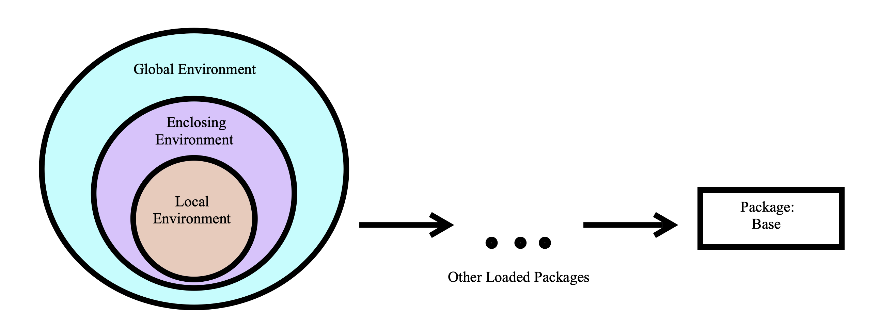

# Functions {#functions}

In R we have functions, functions are another type of object in R.  We use functions in order to preform a series of tasks repeatedly, or preform these tasks in different settings.  They can make our code much more efficient.  We can build our own functions or we can use built in functions. Here we describe both types and their properties. Parts of this chapter where adapted by @r-func and @dummies2015. 


## Build Your Own Function

 To define a function, a name is assigned and the keyword `function` is used to denote the start of the function and its argument list. Functions are created using the `function()` directive and are stored as R objects just like anything else. In particular, they are R objects of class *function*. Functions can be passed as arguments to other functions. Functions can be nested, so that you can define a function inside another function.


Below is the **general template**

```{r, eval = F}
function_name <- function(arg){
  # Function Body 
  ....
  return(return_value)
}
```

In this template we have the following key components

- `function_name`: This is the actual name of the function. It is stored in R environment as an object with this name.
- `function`: A directive which tells R a function is being created. 
- `arg`:  An argument is a placeholder. When a function is invoked, you pass a value to the argument. Arguments are optional; that is, a function may contain no arguments. Also arguments can have default values.
- `function body`:  The function body contains a collection of statements that defines what the function does.
- `return_value`: The output value of the function.  If `return(return_value)` is not supplied then the return value of a function is the last expression in the function body to be evaluated. Your function can only return one object. This object can be any class of object you desire, like a vector, list or data frame, but you may only return one object.


Below is an example of converting a temperature from Fahrenheit to Celsius. 

```{r}
# Convert temperature from Fahrenheit (F) to Celsius (C)
# ARGUMENTS: temp_F, a numeric vector of length 1 in F units
# RETURNS:   temp_C, a numeric vector of length 1 in C units
fahrenheit_to_celsius <- function(temp_F){
  temp_C = (temp_F - 32) * 5 / 9
  return(temp_C)
}
```

In this example the function name is `fahrenheit_to_celsius`, there is only one input or argument, `temp_F`, and the output is the object `temp_C`.

Now if we would like to "call" this function we can simply put into the command console the function name and desired input.  

```{r}
# Convert 87F to Celsius
fahrenheit_to_celsius(temp_F = 87)
```


What would happen if we tried to call this function without supplying an input?  This would result in an error. 

```{r,eval=F}
# temp_F not defined. 
fahrenheit_to_celsius()
```


```
Error in fahrenheit_to_celsius() : 
  argument "temp_F" is missing, with no default
```

With functions we can define function arguments to have default values.  These default values are used only if the user did not supply an argument value. Observe the example below. 

```{r}

# An example function, does simply algebra 
# ARGUMENTS: a = 1 (default), a numeric vector of length 1 
#            b, a numeric vector of length 1
# RETURNS:   d, a numeric vector of length 1
example_func <- function(a = 1, b){
  c = a + b
  d = c + 1
  
  # returns a+b+1
  return(d)
}

# Call example function
example_func(a= 2, b= 3)
example_func(b = 3)
```


Further notice that R has three ways to match function inputs to the formal arguments of the function definition. R attempts to match inputs to arguements in the following order. 

1) by complete name

2) by partial name (matching on initial *n* characters of the argument name)

3) by position

After running a function command R first attempts to match arguments by complete name, then by partial name, and then by position.  If it unable to match inputs to an argument it then uses the default argument value, if one exists.

Observe: 

```{r}
example_func(2, 3)
example_func(b = 3, a = 2)
example_func(a = 2, b = 3)
```


## Lexical Scoping 

With all these examples of functions, notice that in your global environment, only the function name was added.  The function arguments, return values, and all objects defined inside the function are not a part of the global environment.  This is not a mistake.  We can define objects locally, or temporarily, when using functions.  These objects are created and used only when the function is running, and quickly discarded once the function finishes. They never are listed in the global environment.  

Sometimes you may have an object defined in multiple places.  When this happens, R uses a system of rules to determine which definition it will use. In other words, how and where we define an object determines the objects *scope*, or range of places that we can use this object. The system of rules R uses for searching for objects is called *lexical scoping*, as opposed to other types of scoping. With this system R looks for objects that are called in a function within the itself, then any enclosing environments, then the global environment, and lastly looking at objects in packages or built-in objects. This is the same searching method that we see in Python and Java.  

```{r, echo = F, message=FALSE, warning=FALSE, fig.align='center', fig.height=3}
library(knitr)

```

## Built-In Functions

R has functions built-in to it just like excel.  You can call these built-in function at any time.  We have already seen a few of these functions. 

- `c()`
- `class()`
- `matrix()`
- `data.frame()`


Below are a few more examples using the built-in dataset `mtcars`, we will use `mtcars$mpg` as a vector of data to analyze. 


* `mean()`: Takes in a vector, and returns the mean of the values in the vector.

```{r}
mean(mtcars$mpg)
```

* `median()`: Takes in a vector, and returns the median of the values in the vector.

```{r}
median(mtcars$mpg)
```

* `var()`: Takes in a vector, and returns the variance of the values in the vector.

```{r}
var(mtcars$mpg)
```

* `sqrt()`: If you give it a vector, it returns the square root of each element in the vector.  If you give it a single number, it returns the square root of the number.

```{r}
sqrt(mtcars$mpg) 
```

* `sd()`: Takes in a vector, and returns the standard deviation of the values in the vector.

```{r}
sd(mtcars$mpg)
```


* `range()`: Takes in a vector, and returns the minimum AND maximum of the values in the vector.

```{r}
range(mtcars$mpg)
```

* `quantile()`: Takes in a vector as the first argument, and a vector of values between 0 and 1 (any number of values) for the second argument.  It will return the corresponding quantiles of the values in the first vector specified by the second vector.

To get the $10^{th}$ and $90^{th}$ percentiles:

```{r}
quantile(mtcars$mpg,c(0.10,0.90))
```


* `summary()`: You can give this a dataset OR a vector.  It returns some summary information about the values in the dataset or vector.

```{r}
summary(cars$speed)
```

One of the great advantages of using R is that there is a ton of resources available to learn about it.  However, this can also be a disadvantage because of the vast amount of information available. The best and first resource you should look at when trying learn more about R functions is the **Help files**.

## Help Files 

The Help files are in R and can be viewed from the lower right window by clicking the *Help* tab.  Here you can search by function name to read about it. Each built in function has a help files, sometimes similar functions are grouped together in the same file. The R Help Files are typically the best resource to get help. 

The R Help files follow a fairly standard outline. You find most of the following sections in every R Help file:

- **Title**: A one-sentence overview of the function.

- **Description**: An introduction to the high-level objectives of the function, typically about one paragraph long.

- **Usage**: A description of the syntax of the function (in other words, how the function is called). This is where you find all the arguments that you can supply to the function, as well as any default values of these arguments.

- **Arguments**: A description of each argument. Usually this includes a specification of the class (for example, character, numeric, list, and so on). This section is an important one to understand, because arguments are frequently a cause of errors in R.

- **Details**: Extended details about how the function works, provides longer descriptions of the various ways to call the function (if applicable), and a longer discussion of the arguments.

- **Value**: A description of the class of the value returned by the function.

- **See also**: Links to other relevant functions. In most of the R editors, you can click these links to read the Help files for these functions.

- **Examples**: Worked examples of real R code that you can paste into your console and run.


An alternative way to view a functions help file is by typing `?` followed by the function name, or by typing `help(function_name)`. 

```{r}
# Find a help file for the function `rep`
?rep
help(rep)
```


If you are not sure exactly which function you want, you can use `??` followed by what you believe the function name is to look at a list of functions. 


```{r}
??rep
```


## The ... Argument

There is a special argument function `...` that can be used.  Sometimes we call a function within a function that has a different set of arguments.  We can use the `...` argument as a general placeholder for passing along any additional arguments in a function call. 

```{r}

# An example function, uses the ... argument and calls fun2()
# ARGUMENTS: x , a numeric vector of length 1 
#            ..., all additional arguments to be passed to fun2()
# RETURNS:   z, a numeric vector of length 1
fun1 <- function(x, ...){
  y = fun2(...)
  z = x + y 
  return(z)
}

# Support function for fun1()
# ARGUMENTS: a , a numeric vector of length 1 
# RETURNS:   b, a numeric vector of length 1
fun2 <- function(a){
  b = a^2
  return(b)
}

# Returns 1 + 2^2 = 5
fun1(1, 2)
```


We can also use the `...` arguement in a nested fashion. 

```{r}

# An example function, uses the ... argument and calls fun2()
# ARGUMENTS: x , a numeric vector of length 1 
#            ..., all additional arguments to be passed to fun2()
# RETURNS:   z, a numeric vector of length 1
fun1 <- function(x, ...){
  y = fun2(...)
  z = x+ y
  return(z)
}

# Support function for fun1(), calls fun3()
# ARGUMENTS: a , a numeric vector of length 1 
#            ..., all additional arguments to be passed to fun3()
# RETURNS:   c, a numeric vector of length 1
fun2 <- function(a, ... ){
  b = fun3(...)
  c = a^2 + b 
  return(c)
}

# Support function for fun1() and fun2(), called by fun2()
# ARGUMENTS: n , a numeric vector of length 1 
# RETURNS:   n, a numeric vector of length 1
fun3 <- function(n){
  n = sqrt(n)
  return(n)
}

#  Returns:  1 + 2^2 + sqrt(4) = 7 
fun1(1, 2, 4)

# Returns:  1 + 2^2 + sqrt(4) = 7 
# Define each input explicitly 
fun1(x = 1, a = 2, n = 4)

```

When using the `...` argument it is customary to always place `...` at the end of a function argument list, as it can be difficult for R to determine which arguments are to be passed to the next function.  If possible, it is good practice to explicitly define the arguments to avoid an error. 

## Generic Functions 

In R we have something called *generic functions* which are functions that behave differently depending on the class type of one of the arguments.  Typically generic functions depend on the class of the first argument.  The functions `mean()`, `summary()`, and `plot()` are all generic functions. These functions act as a "middle man" or a "dispatcher". The generic function calls the actual function you desire.  For example, when we call `summary()` and the first argument is a `lm` object, then the summary function that is actually run is `summary.lm()` which may have its own help file. 

## Additional Resources {-}

- [Chapter 14 of "R for Programming in Data Science"](https://bookdown.org/rdpeng/rprogdatascience/functions.html#the-...-argument) 
- [Chapter 13 of "Advanced R"](https://adv-r.hadley.nz/s3.html)
- Videos:
    + [R Functions 1 | Anatomy of a Function](https://ucr.yuja.com/V/Video?v=2390137&node=8588230&a=1409376127&autoplay=1)
    + [R Functions 2 | Getting Help](https://ucr.yuja.com/V/Video?v=2368890&node=8488096&a=1477744713&autoplay=1)
    + [R Functions 3 | Argument Order and Default Values](https://ucr.yuja.com/V/Video?v=2368889&node=8488095&a=762120086&autoplay=1)
    + [Writing Functions 1 | Introduction](https://ucr.yuja.com/V/Video?v=2700489&node=9649685&a=1404409900&autoplay=1)
    + [Writing Functions 2 | 4 Fundamental Steps](https://ucr.yuja.com/V/Video?v=2700492&node=9649688&a=604881114&autoplay=1)
    
